# Backend Architecture — Mermaid Diagrams

Visual reference for how the Underground Music Discovery backend actually works
(grounded in the code under `app/`, not just the original plan).

> **Heads up — a few things to know up front:**
> - **Production API is on Coolify, not Railway.** Public base:
>   `https://pyo-backend.pedroboudoux.com`; health:
>   `https://pyo-backend.pedroboudoux.com/health`. From Pedro's MacBook, use
>   `ssh pedro-homelab` to inspect the Coolify host. The Coolify app is
>   `pyo prod` (`id=1`, uuid `y120lq5jmtgobmx27s562roa`) built from
>   `pedro-boudoux/pyo` branch `main` with Nixpacks. Treat Coolify env values,
>   especially `DATABASE_URL`, as secrets.
> - **Spotify plays no part in search, embeddings, or recommendations.** Its one
>   narrow role is resolving a public "listen on Spotify" link
>   (`services/spotify.py`, client-credentials flow) via `GET /songs/{id}/spotify`
>   — optional, and the result is cached on the `songs` row.
> - **IDs are `track_id`**, a 20-char SHA1 of `"{artist}|||{track}"` (see `embeddings.make_track_id`), not `spotify_id`.
> - A second, looser **`canonical_key`** folds cosmetic variants (clean/explicit/
>   remastered/…) of the same recording so duplicates don't flood recs (issue #11, diagram 3a).
> - **Album covers** come from Deezer → iTunes → Deezer artist photo (`services/covers.py`).
> - Extra machinery beyond the original plan: **blended tags**, **MMR re-ranking**,
>   **reject steering**, **linear & tree playlists**, **recursive seed expansion**,
>   and **dominant-tag aggregation** (`POST /graph/tags`, issue #2).
> - **Embeddings are dense semantic vectors now (algorithm 2.0, Phase 1).** Each
>   Last.fm tag is encoded with `all-MiniLM-L6-v2` (`fastembed`, ONNX/CPU) and a
>   track's `vector(384)` is the count-weighted average of its tag vectors. This
>   replaced the old sparse `vector(300)` slot model (kept per row as
>   `embedding_legacy_300` for rollback). Phase 2 stores learned graph vectors in
>   `colisten_embedding` and builds a separately indexed `hybrid_embedding`
>   (`vector(512)`). Production serves the hybrid path at `COLISTEN_BETA=2`;
>   `RECOMMENDATION_MODEL` can switch back to intact Stage A for instant rollback.
>   See `PHASE2_TODAY_PLAN.md` for the rollout record and `PROJECT_PLAN.md` for
>   remaining work.

## Two shared building blocks

Most of the flows below are built from the same two helpers, so several diagrams
reference them instead of redrawing the steps:

- **`ingest.embed_and_store_track(artist, name, listener_cap)`** — the *one*
  tag→vector embedding pipeline (diagram 3). Cache-aware: returns the stored row
  if already embedded, otherwise runs the Last.fm calls + `blend_tags` + vector
  build and upserts. Used by seeding, `/songs/.../features`, recommendation
  top-up, and playlist backfill.
- **`embeddings.ann_search(embedding, *, listeners_cap, exclude_ids, allowed_ids, limit, cursor)`**
  — the *one* pgvector nearest-neighbor query. Used by seeding, recommendations,
  feedback (accept rerun), and both playlist strategies.

---

## 1. System overview

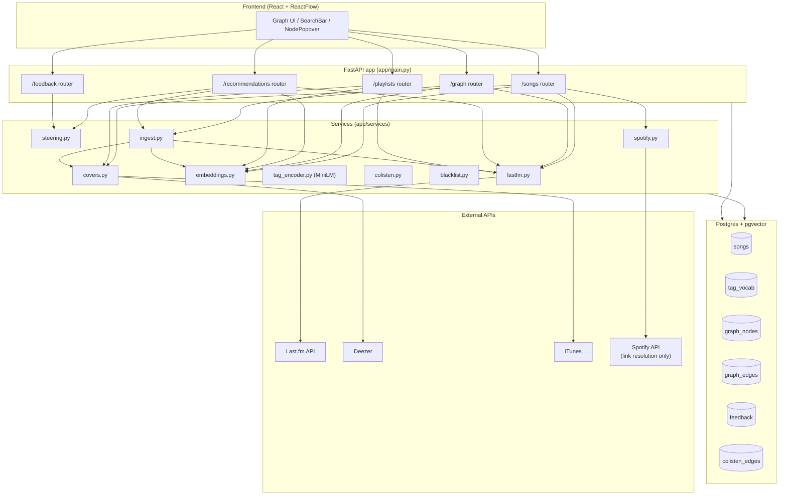

---

## 2. Database schema (ER)

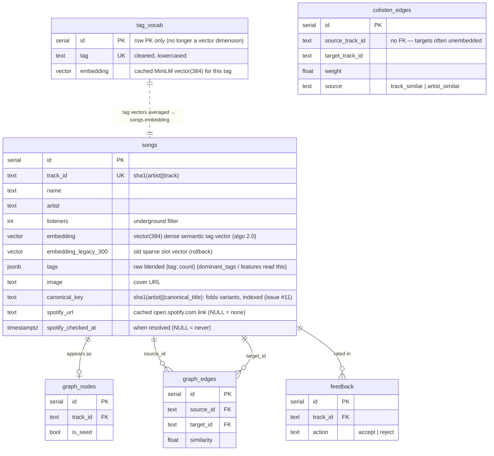

---

## 3. Embedding pipeline (tags → vector) — `ingest.embed_and_store_track`

How any `(artist, track)` becomes a stored dense `vector(384)` semantic embedding
(algorithm 2.0, Phase 1). This *is* `ingest.embed_and_store_track` — the single
shared block every other flow calls when it needs an embedding
(`services/ingest.py`, `services/embeddings.py`, `services/tag_encoder.py`,
`lastfm.blend_tags`). A cache hit short-circuits before any Last.fm call.

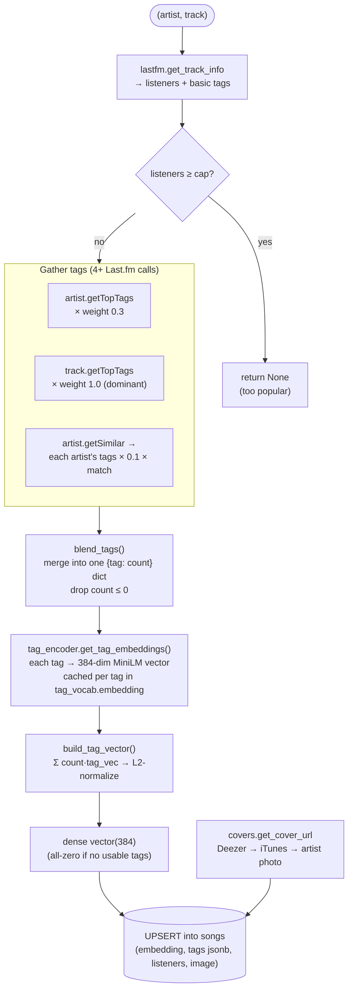

---

## 3a. Canonical key — folding cosmetic variants (issue #11)

`track_id` keys the *exact* title, so "Song", "Song (Clean)" and "Song -
Remastered 2011" get different ids and slip past track_id dedupe — yet their tags
(and vectors) are near-identical, so the duplicate ranks at the top of recs. A
second, looser identity collapses them: `canonical_key = sha1(artist|||canonical_title(track))`
(`embeddings.canonical_title` / `make_canonical_key`). It's stored on `songs`
(indexed, nullable → "no folding"), backfilled by `POST /songs/backfill-canonical`,
and used to dedupe at the search merge, the recommendation pool/exclusion/top-up,
and the seed bootstrap pool. `track_id` stays the FK/cache key.

```mermaid
flowchart TD
    in(["raw track title"]) --> low["lowercase + strip"]
    low --> kind{"qualifier in (…)/after -?"}

    kind -->|cosmetic<br/>clean·explicit·dirty·remastered[ YYYY]·<br/>single/album version·radio edit·mono/stereo·<br/>bonus track·trailing feat.| strip["STRIP it<br/>→ folds into base recording"]
    kind -->|variant<br/>live·acoustic·remix·demo·instrumental| keepgen{"generic marker?"}
    kind -->|none / numbered<br/>(Untitled 02)| asis["leave title as-is"]

    keepgen -->|generic<br/>'(Live)', '- live', '(Live Version)'| normtok["normalize to '(marker)' token<br/>→ spellings merge, stays distinct from studio cut"]
    keepgen -->|named/specific<br/>'(Tiësto Remix)', '(Live at Wembley)'| keepfull["keep full title<br/>→ stays distinct"]

    strip --> key
    normtok --> key
    keepfull --> key
    asis --> key["sha1(artist|||canonical_title)<br/>= canonical_key"]
```

---

## 4. Song search (`GET /songs/search`)

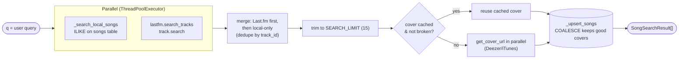

---

## 5. Seeding the graph (`POST /graph/seed`)

The core loop. Builds the seed embedding (cache-aware), runs ANN search,
bootstraps from Last.fm `getSimilar`, and recursively expands so the
neighborhood is dense enough for playlists.

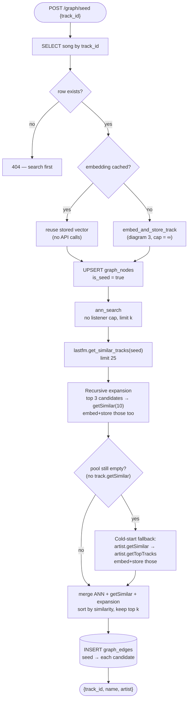

---

## 5a. Dominant tags across a graph (`POST /graph/tags`, issue #2)

"Which genres are taking over." Sums each song's blended tag weights (read from the
`songs.tags` jsonb — the dense averaged embedding can't be inverted back to discrete
tags) across a node set and returns the top `top_n` as `{ tag, weight, count, share }`
(`embeddings.dominant_tags`). Pass `track_ids` to scope to exactly what the UI is
showing; omit it to aggregate the whole persisted graph.

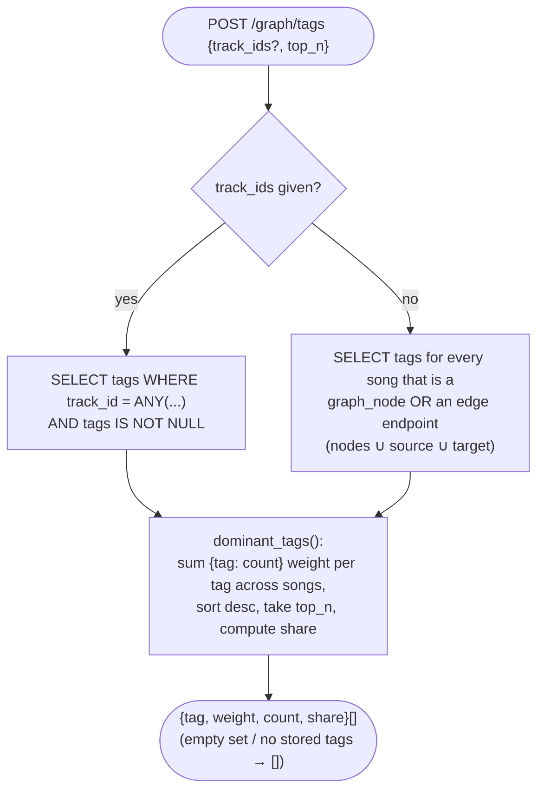

---

## 6. Recommendations (`GET /recommendations/{track_id}`)

ANN + reject-steering + per-artist cap + MMR diversity, with two fallbacks to
honor the requested `k`.

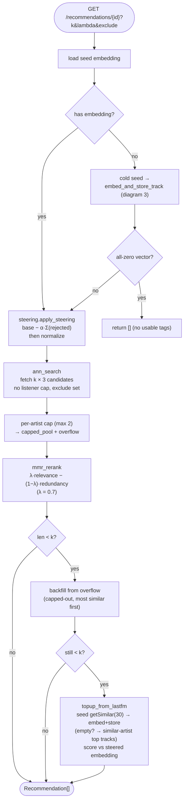

### Reject steering (`services/steering.py`)

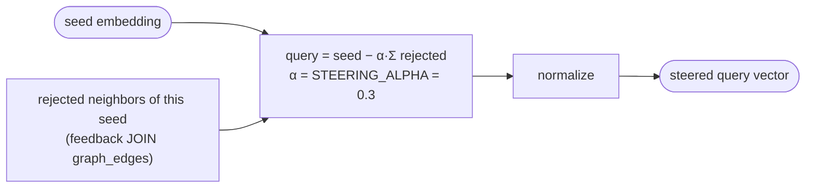

---

## 7. Feedback loop (`POST /feedback`)

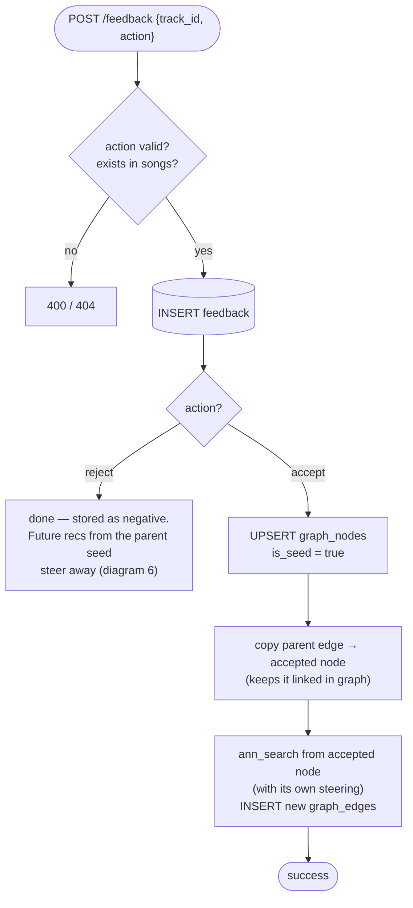

---

## 8. Playlist generation (`POST /playlists/*`)

Two strategies over the seed's graph neighborhood. `niche` mode walks listener
thresholds (100 → 1k → 10k → 100k → ∞) to favor the most underground tracks.

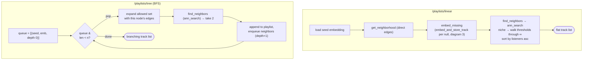

---

## 9. End-to-end discovery journey

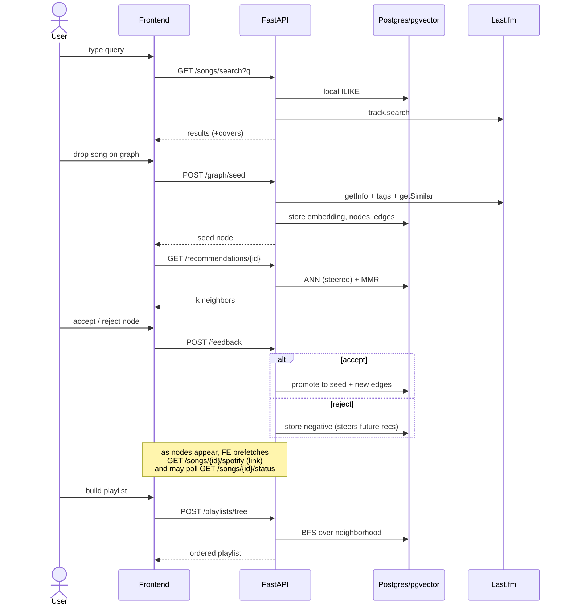

---

## 10. Spotify "listen on" link (`GET /songs/{track_id}/spotify`)

The only place Spotify is touched. Resolves a public `open.spotify.com` URL via
the client-credentials search (`services/spotify.py`) and **persists it on the
`songs` row** so later calls are free. A non-definitive result (creds unset /
network error → `checked=false`) is *not* stored, so it's retried next time.

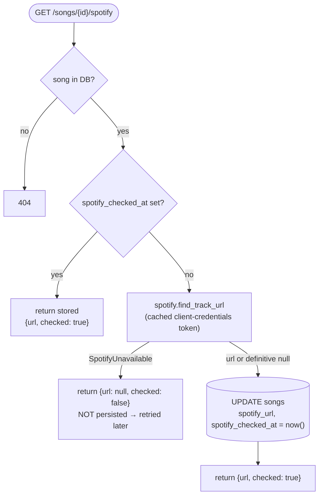

> `GET /songs/{id}/status` is a sibling lightweight check — `{ exists, cached }`
> where `cached` means an embedding is already stored — used by the frontend to
> warn about slow "cold" seeds.
